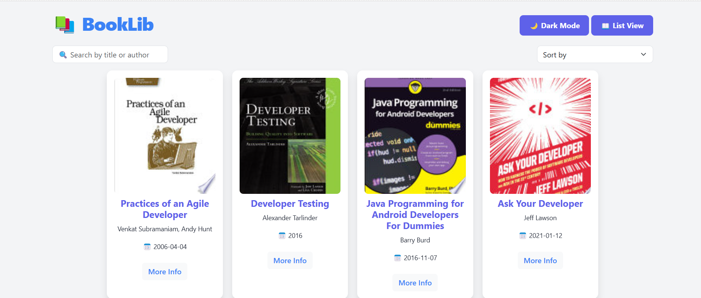

📚 Book Library
A beautifully designed Book Library Web App that allows users to browse books, switch between grid and list views, and toggle between dark and light modes. Built with HTML, CSS, JavaScript, and Bootstrap, this application fetches books from an API and presents them in an interactive layout.

🚀 Features
✅ Grid & List Views - Grid view by default, with an improved list view option
✅ Dark & Light Mode - Seamless toggle between dark and light themes
✅ Search & Sorting - Search books by title or author, and sort by title or publication date
✅ API Integration - Fetches book details dynamically from a public API
✅ Responsive Design - Fully mobile-friendly and works on all screen sizes
✅ Load More Functionality - Dynamically fetches more books as needed

🎨 Screenshots
  
  
🛠️ Technologies Used
Frontend: HTML, CSS, JavaScript, Bootstrap

API: FreeAPI Books API

🔗 Live Demo
👉 **[Try the App Here]()**
